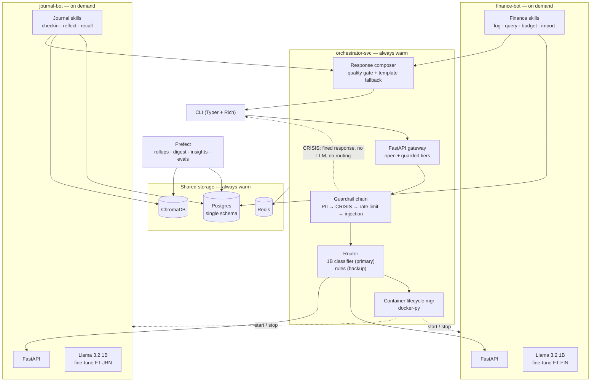
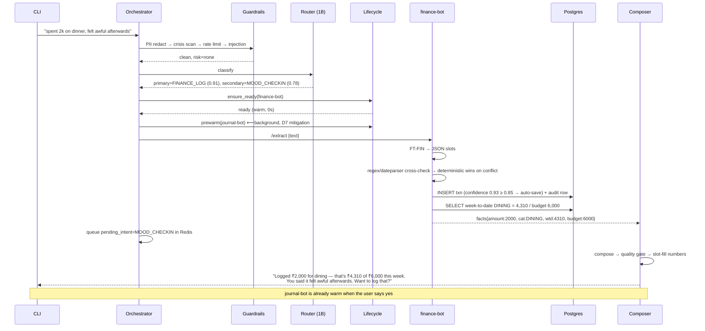

# Journaling Chatbot — Architecture

A CLI-first personal assistant built as a **master orchestrator routing to specialist bots**,
each a separately fine-tuned **Llama 3.2 1B** in its own container, started and stopped on
demand.

Two specialists today — **personal finance** and **journaling / mood** — with the
orchestrator designed so a third is an additive change.

The differentiating feature is **cross-domain correlation**: finance and mood share one
timeline, so the system can surface links neither a budgeting app nor a mood tracker can
see alone.

---

## 0. Decisions log

Locked via discovery. Recorded here because several are non-obvious and I'd otherwise
re-derive them wrongly later.

| # | Decision | Rationale / consequence |
|---|---|---|
| D1 | **Portfolio + daily-use, both** | Every component solves a real problem; nothing is decorative |
| D2 | **No fixed deadline** | Phases sequenced so each ends in something demoable |
| D3 | **Full container isolation per bot** | Each bot owns its model. ~20s cold start, accepted (see §3.2 mitigation) |
| D4 | **Two fully separate fine-tunes** | Not shared-base LoRA. Independent training, versioning, eval per bot |
| D5 | **Orchestrator runs its own 1B** for routing | Third model instance; rules router as fallback |
| D6 | **Routing: model primary, rules backup** | Rule router doubles as circuit-breaker path |
| D7 | **Multi-intent: route primary, queue secondary** | Plus background pre-warm of the secondary container |
| D8 | **Docker SDK lifecycle from orchestrator** | `docker-py`, health-poll to ready, 10-min idle stop |
| D9 | **Single shared Postgres schema** | Container split is service-level, not data-level |
| D10 | **Crisis scan in orchestrator, pre-routing** | The only placement a routing error can't defeat |
| D11 | **Fully conversational** | Achieved via constrained generation + quality gate (§6) |
| D12 | **Mood: 1–5 self-report + free text** | Self-report is ground truth for measuring inferred valence |
| D13 | **Valence/arousal + open-vocabulary tags** | Numeric backbone for correlation, tags for texture |
| D14 | **India — INR (integer paise), Indian helplines** | KIRAN 1800-599-0019, Tele-MANAS 14416 |
| D15 | **Gemini via `agy` CLI** for synthetic data | `--json-schema` gives enforced structured output |
| D16 | **300 hand-labelled test examples** | Purpose-built labelling CLI; the core eval credibility |
| D17 | **Finance scope: all four** | Budgets, CSV import, income/savings, recurring detection |
| D18 | **Public repo, synthetic demo data** | Real data gitignored from commit 1 |
| D19 | **English only** | No code-switching or transliteration in training data |

---

## 1. The core design constraint

Llama 3.2 1B cannot be trusted as a free-form conversational brain. At 1B it hallucinates
numbers, drifts off-persona, and produces generic advice that is actively bad in a
mental-health context. One rule governs everything below:

> **The LLM never owns truth, money, or safety.**
> It converts language → structure, and structure → short language.
> Deterministic Python owns arithmetic, SQL, and every safety decision.

| Concern | Owner | Why |
|---|---|---|
| "How much did I spend on food?" | SQL `SUM()` | An LLM doing arithmetic is a bug generator |
| "Is this a crisis message?" | Rules ∪ classifier, in the orchestrator | Recall must be ~1.0; a 1B cannot be trusted to say "no" |
| "What did the user spend it on?" | **Fine-tuned LLM** → JSON → validated | Genuinely hard NLP; this is the model's job |
| "Phrase the reply" | **Fine-tuned LLM** + quality gate | Templated, with grounded numbers injected |
| "What are the numbers in the reply?" | SQL, injected as slots | The model is forbidden from emitting free digits |

D11 (fully conversational) does **not** relax this. See §6 for how open-ended feel is
achieved without open-ended risk.

---

## 2. Technology map

Each row solves a problem the design actually has.

| Technology | Component | Problem solved |
|---|---|---|
| **LLM fine-tuning (LLaMA)** | 3 × QLoRA fine-tunes of Llama 3.2 1B | Base 1B can't emit reliable JSON or hold persona |
| **PyTorch** | PEFT/TRL training loops; DistilRoBERTa emotion cross-check | The fine-tunes themselves |
| **NLP (classical)** | spaCy NER, `dateparser`, regex money/date extraction | Deterministic extraction the model shouldn't guess |
| **Deep learning (HF)** | `all-MiniLM-L6-v2` embeddings, emotion classifier | Retrieval + second opinion on mood |
| **LangChain** | Retriever chain, prompt registry, output parsers | RAG plumbing + typed LLM output |
| **RAG + Vector DB** | ChromaDB: journal chunks + public CBT/psychoed KB | "What did I say about work stress last month?" |
| **FastAPI** | Orchestrator gateway + one API per bot | Open/guarded tier split; inter-service contracts |
| **SQL** | Postgres: transactions, moods, budgets, audit | Money must be relational, ACID, queryable |
| **NoSQL** | Redis: session state, pending intents, rate limits, container leases | Ephemeral, TTL-shaped state |
| **Prefect** | Nightly rollups, weekly digest, embedding backfill, evals | Insights are batch-computed, not chat-time |
| **Docker + docker-py** | Per-bot containers with programmatic lifecycle | D3/D8 — the orchestration story |
| **Kubernetes** | Manifests + scale-to-zero design, validated not deployed | Deployment narrative without cluster cost |
| **MLOps** | MLflow tracking + registry, DVC datasets, GH Actions eval gate | 3 models × N versions needs real versioning |
| **GPU / optimization** | 4-bit QLoRA training; GGUF Q4_K_M; constrained decoding | 8GB VRAM across 3 concurrent model processes |
| **3rd-party AI APIs** | Gemini via `agy` — synthetic data + LLM-as-judge | Bootstraps training sets; grades the students |
| **Chatbot dev** | Typer + Rich CLI, streaming, slash commands | The deliverable |

---

## 3. System architecture

### 3.1 Service topology



### 3.2 Container lifecycle (D3 + D8)

The orchestrator owns bot lifecycle through `docker-py`:

```python
class BotLifecycle:
    IDLE_TTL = timedelta(minutes=10)

    async def ensure_ready(self, bot: BotName) -> str:
        c = self.docker.containers.get(bot.container_name)
        if c.status != "running":
            c.start()
            await self._poll_ready(bot, timeout=45)   # GET /ready until 200
        await self.redis.set(f"lease:{bot}", now(), ex=self.IDLE_TTL)
        return bot.base_url

    async def prewarm(self, bot: BotName) -> None:
        """Fire-and-forget. Used for queued secondary intents (D7)."""
        asyncio.create_task(self.ensure_ready(bot))
```

**Cold start is ~20s, accepted per D3.** Three mitigations keep it from being felt:

1. **Pre-warm on secondary intent.** When the router sees a second intent it won't handle
   this turn, it starts that container in the background *while the primary bot answers*.
   By the time the queued follow-up fires, the container is warm. This is what makes D7 and
   D3 coexist.
2. **Lease-based idle stop.** A Redis lease is refreshed on every request; a reaper stops
   containers whose lease expired. Activity extends life automatically.
3. **Honest UX.** The CLI shows a spinner with `starting finance-bot…` rather than an
   unexplained pause. A visible 20s beats a mysterious 20s.

**VRAM budget** (RTX 5060 Laptop, 8GB):

| Process | 4-bit weights | KV + CUDA ctx | Total |
|---|---|---|---|
| orchestrator (router 1B) | ~0.8GB | ~0.5GB | ~1.3GB |
| finance-bot | ~0.8GB | ~0.7GB | ~1.5GB |
| journal-bot | ~0.8GB | ~0.7GB | ~1.5GB |
| embeddings + emotion | — | — | ~0.4GB |
| **All three co-resident** | | | **~4.7GB** |

Fits in 8GB with the desktop. In practice only the orchestrator plus one bot are up
(~2.8GB); all three coincide only on multi-intent turns.

---

## 4. Request lifecycle



---

## 5. Routing (D5 + D6 + D7)

```python
async def route(text: str) -> RouteDecision:
    if (r := rule_router(text)).is_definitive:      # /finance, /journal, obvious patterns
        return r
    try:
        pred = await router_model.classify(text)     # 1B, constrained decode over labels
        if pred.top_confidence >= 0.60:
            return RouteDecision.from_model(pred)
    except (ModelUnavailable, TimeoutError):
        metrics.router_fallback.inc()                # rules become the circuit breaker
    return rule_router(text).with_fallback()
```

**Intents:** `FINANCE_LOG`, `FINANCE_QUERY`, `BUDGET_SET`, `IMPORT`,
`MOOD_CHECKIN`, `JOURNAL_FREE`, `RECALL`, `INSIGHT`, `SMALLTALK`, `CRISIS`, `META`, `UNKNOWN`.

**Multi-intent (D7):** the classifier emits ranked intents. The top one is handled now; any
secondary above threshold is written to `pending:{user}:{sid}` in Redis and its container
pre-warmed. The composer appends a natural bridge to the reply ("Want to log that?") rather
than a robotic queue notice.

---

## 6. Making "fully conversational" safe (D11)

D11 is the riskiest decision in the project — open-ended generation is precisely where a 1B
degrades. It is made safe by constraining *how* it generates, not *whether* it does.

**1. Short by construction.** Responses cap at 2 sentences / 45 tokens. 1B coherence falls
off sharply with length; short replies also read as warm rather than lecturing.

**2. Follow-ups are selected, not generated.** A curated bank of ~120 journaling follow-ups,
tagged by context. The model *chooses* one via constrained decode over IDs. This alone
removes most of the failure surface, because follow-up questions are where a small model
most reliably says something tone-deaf.

**3. Numeric guard.** Any digit emitted outside a `{slot}` placeholder is stripped and
logged as a violation. Numbers come from SQL or they don't appear.

**4. Quality gate with template fallback** — every generated reply must pass before it ships:

| Check | Rejects |
|---|---|
| Length | > 45 tokens |
| Repetition | trigram repeat, or echoing the user's words verbatim |
| Digit leakage | ungrounded numerals |
| Banned phrases | "I hear you", "as an AI", "I'm sorry to hear", diagnosis language |
| Persona drift | first-person claims of feeling/experience |
| Relevance | embedding similarity to the user turn below threshold |

On failure: one regeneration at lower temperature, then a **template fallback**. The
degradation path is "slightly generic," never "actively wrong." Gate rejection rate is a
tracked metric — a rising rate means the fine-tune has regressed.

**5. Tone target: warm but spare.** Short, plain, no therapy-speak. Deliberately chosen over
effusive warmth because it's achievable at 1B and fails gracefully.

---

## 7. Guardrails

Runs in the orchestrator, before routing (D10).

```python
async def guarded(request: Request, user: User = Depends(current_user),
                  _rl: None = Depends(rate_limit("60/min"))) -> GuardContext:
    text = (await request.json()).get("message", "")

    redacted, pii_map = redact_pii(text)
    risk = crisis_detector(redacted)          # rules ∪ classifier — UNION, never intersection
    if risk.level is Risk.CRITICAL:
        raise CrisisInterrupt(risk)           # fixed response; no routing, no bot, no generation
    if injection_scan(redacted).flagged:
        raise GuardrailViolation("injection")

    audit.log(user.id, request.url.path, risk.level)
    return GuardContext(user, redacted, pii_map, risk)
```

Crisis detection sits here specifically because *"lost my job, blew my savings, can't do
this anymore"* routes to the **finance** bot. Placing the scan downstream would let a
routing decision cause a safety miss.

Four further guards deeper in the stack:

1. **Schema guard** — every LLM JSON output parsed by Pydantic; on failure, one repair retry
   with the validation error appended, then a clarifying question.
2. **Write guard** — auto-save above 0.85 confidence, confirm below, `/undo` always available.
3. **Numeric guard** — §6.3.
4. **Tenancy guard** — `user_id` mandatory on every SQL query and Chroma filter, enforced in
   the repository layer, not in handlers.

---

## 8. API surface

### OPEN tier — no auth, no PII

| Method | Route | Purpose |
|---|---|---|
| `GET` | `/health`, `/ready` | Liveness; readiness includes model-loaded |
| `GET` | `/model/info` | Base model, fine-tune version, quantization, per bot |
| `GET` | `/bots/status` | Which containers are up, uptime, lease remaining |
| `GET` | `/kb/search?q=` | Public CBT/psychoeducation KB — no user data |
| `GET` | `/taxonomy/categories` | Category enum |
| `GET` | `/metrics` | Prometheus |

### GUARDED tier — auth + rate limit + audit + guardrail chain

| Method | Route | Notes |
|---|---|---|
| `POST` | `/chat` | Full pipeline, SSE streaming |
| `POST` | `/finance/transactions` | Idempotency key required |
| `GET` | `/finance/summary` | Params from whitelisted enum (§9) |
| `POST` | `/finance/budgets` | Requires confirmation token |
| `POST` | `/finance/import` | CSV upload, async job, dedupe |
| `POST` | `/mood/checkin` | Crisis scan runs even on structured input |
| `GET` | `/mood/trend` | Windowed aggregation |
| `POST` | `/journal/entries` | PII redaction before embedding |
| `GET` | `/journal/search` | RAG, `user_id`-filtered at the vector layer |
| `GET` | `/insights/weekly` | Reads precomputed Prefect output |
| `DELETE` | `/user/data` | Purges SQL + vectors + Redis together |

### Internal — bot APIs, not exposed

Each bot exposes `/ready`, `/extract`, `/handle`, `/shutdown`. Reachable only on the Docker
network; the orchestrator is the sole client.

---

## 9. Query → params, never text-to-SQL

The model emits a constrained descriptor; Python builds the SQL.

```python
class QuerySpec(BaseModel):
    metric: Literal["SUM", "AVG", "COUNT", "MAX"]
    dimension: Literal["category", "merchant", "payment_method", "day", "week"] | None
    categories: list[CategoryEnum] = []
    date_range: Literal["TODAY","THIS_WEEK","LAST_WEEK","THIS_MONTH","LAST_MONTH","LAST_30D","YTD"]
    limit: int = Field(default=10, le=100)
```

The output space is a small enum product. It cannot express `DROP TABLE`, cannot reach
another user, cannot invent a column.

---

## 10. Data model (D9 — single shared schema)

Container isolation is service-level; the data layer is shared. Per-table ownership is a
documented convention plus a `# owner:` annotation, so splitting later is mechanical.

```sql
users(id, handle, created_at, tz, currency DEFAULT 'INR')

-- owner: finance-bot
transactions(
  id, user_id FK, amount_minor BIGINT,        -- integer paise; never float
  direction ENUM('debit','credit'),           -- D17: income support
  category ENUM, merchant TEXT, occurred_on DATE,
  payment_method ENUM, source ENUM('chat','api','import'),
  import_batch_id FK NULL, dedupe_hash TEXT,  -- D17: CSV import
  raw_text TEXT, extraction_confidence REAL, confirmed BOOL, created_at
)
budgets(id, user_id, category, period ENUM, limit_minor, active_from, active_to)
recurring_candidates(id, user_id, merchant, category, period_days, mean_minor,
                     confidence, last_seen, confirmed BOOL)
import_batches(id, user_id, filename, row_count, duplicates_skipped, status, created_at)

-- owner: journal-bot
mood_entries(
  id, user_id,
  self_report INT,           -- D12: 1-5, GROUND TRUTH
  valence REAL, arousal REAL,-- D13: model-inferred
  emotion_tags TEXT[],       -- D13: open vocabulary
  sleep_hours REAL, energy INT, social_contact BOOL,   -- correlation covariates
  note TEXT, classifier_valence REAL,                  -- DistilRoBERTa cross-check
  recorded_at
)
journal_entries(id, user_id, body, redacted_body, chunk_count, created_at)

-- owner: orchestrator
insights(id, user_id, kind, payload JSONB, window_start, window_end, generated_at)
audit_log(id, user_id, action, route, risk_level, payload_hash, created_at)
llm_calls(id, user_id, bot, task, model_version, prompt_tokens, completion_tokens,
          latency_ms, json_valid BOOL, repaired BOOL, gate_rejected BOOL, created_at)
routing_decisions(id, user_id, text_hash, primary_intent, primary_conf,
                  secondary_intent, used_fallback BOOL, created_at)
```

Three tables exist purely for evidence, and they are what make the project measurable:

- **`mood_entries.self_report` vs `valence`** — D12's payoff. Continuous, zero-effort
  validation of the mood fine-tune against user-supplied ground truth.
- **`llm_calls`** — JSON-validity, repair, and gate-rejection rates over time. This is how
  you detect a regressed fine-tune in production.
- **`routing_decisions`** — router accuracy and fallback frequency.

### ChromaDB

- `journal_chunks` — `{user_id, entry_id, date, valence, chunk_idx}`
- `knowledge_base` — public, licence-checked psychoeducation, cited by title/URL

### Redis

| Key | TTL | Contents |
|---|---|---|
| `sess:{user}:{sid}` | 30m | Turn history, conversation state |
| `pending:{user}:{sid}` | 15m | Queued secondary intent (D7) |
| `slots:{user}:{sid}` | 15m | Partial transaction awaiting confirmation |
| `lease:{bot}` | 10m | Container idle lease (D8) |
| `rl:{user}`, `idem:{key}` | 60s / 24h | Rate limit, idempotency |

---

## 11. Insight engine

Statistics, not LLM output — the model only phrases the finding.

| Insight | Method |
|---|---|
| **Spend ↔ mood lag correlation** | Spearman between daily discretionary spend and next-day valence, 90-day rolling, min-n gate |
| **Sleep-mediated spending** | Does low sleep (t−2) predict unplanned spend (t)? Covariates from D12 |
| **Emotional spending** | P(unplanned category spend \| valence < −0.3 in prior 24h) |
| **Category anomaly** | Robust z-score (MAD) vs the user's own 8-week baseline |
| **Self-report vs inferred drift** | Divergence between `self_report` and `valence` — model health *and* a genuine "you rated it 4 but wrote like a 2" insight |
| **Recurring-cost drift** | Autocorrelation over dates; alert on amount increases (D17) |
| **Weekly digest** | All of the above, LLM-phrased, numbers injected |

Every insight is **correlational, framed as a question**, never a diagnosis: *"Dining spend
has been higher on days after short sleep — does that match how it felt?"*

---

## 12. Fine-tuning (D4 — three separate models)

| Model | Task | Data | Notes |
|---|---|---|---|
| **FT-ROUTER** | Intent classification, multi-intent ranking | ~4k | Constrained decode over label tokens |
| **FT-FIN** | Slot extraction, category normalization, query-spec | ~8k | Hardest task; largest set |
| **FT-JRN** | Mood tagging, reflection, follow-up selection | ~6k | Trained toward the §6 quality gate |

Three models means three training runs, three eval suites, three registry entries — more
work than shared adapters, but genuinely independent versioning and a cleaner MLOps story.

### Data generation via `agy` (D15)

`agy` is Antigravity's Gemini-backed CLI, on PATH at
`C:\Users\kvx12\AppData\Local\agy\bin\agy.exe`. It supports non-interactive prompting with
**enforced structured output**:

```bash
agy -p "$(cat prompts/gen_finance_slots.txt)" \
    --model gemini-3.6-flash-medium \
    --json-schema schemas/finance_example.json \
    --output-format json
```

`--json-schema` means generated examples are schema-valid at the source, so the validation
stage catches semantic errors rather than parse errors.

**Model split:** `gemini-3.6-flash-medium` for bulk generation, `gemini-3.1-pro-high` for
the ~500 hardest examples and for LLM-as-judge eval.

**Constraint note:** `agy` is subscription-metered, not pay-per-token, so **throughput is
the limit, not cost**. Generation runs as a resumable, checkpointed batch job with a
concurrency cap — not a fire-and-forget loop. It also can't run in CI, so datasets are
generated locally and versioned via DVC.

```
~200 hand-written seed prompts (your real phrasings)
  → agy/Gemini expands to ~18k across the three tasks
    (personas · registers · typos · multi-intent · negation · correction)
  → programmatic validation (schema, slot consistency, amount sanity)
  → dedupe by embedding similarity
  → DVC-versioned, pushed to HF Hub (private)
  → stratified split; test set frozen day one
```

**English only (D19).** Over-sample: multi-intent, ambiguous dates ("last Tuesday"),
negation ("didn't end up buying it"), correction ("no wait, 540"), terse fragments
("450 groceries"), buried amounts ("bill came to about 1.2k after the discount").

### Training config (per model, fits 8GB)

```python
BitsAndBytesConfig(load_in_4bit=True, bnb_4bit_quant_type="nf4",
                   bnb_4bit_compute_dtype=torch.bfloat16, bnb_4bit_use_double_quant=True)

LoraConfig(r=16, lora_alpha=32, lora_dropout=0.05,
           target_modules=["q_proj","k_proj","v_proj","o_proj",
                           "gate_proj","up_proj","down_proj"])

SFTConfig(per_device_train_batch_size=4, gradient_accumulation_steps=8,
          learning_rate=2e-4, lr_scheduler_type="cosine", warmup_ratio=0.03,
          num_train_epochs=3, bf16=True, gradient_checkpointing=True,
          packing=True, max_seq_length=1024)
```

Loss masked to completion tokens. Adapters are merged into standalone models post-training
(D4), since each bot ships its own.

### Evaluation (D16)

**300 hand-labelled held-out examples**, produced with a purpose-built CLI:

```
$ journal-label
[47/300]  "grabbed lunch w/ team, 850, felt good"
  intent?  [1]FIN_LOG [2]MOOD [3]BOTH [4]JOURNAL  > 3
  amount: 850   category: [DINING]   valence: +0.4
  correct? [y/n/edit] > y
```

This is the difference between "Gemini agrees with itself" and real measurement.

| Metric | Target | Source |
|---|---|---|
| Router accuracy | ≥ 0.95 | Hand-labelled |
| Router fallback rate | < 2% | `routing_decisions` |
| Slot exact-match F1 | ≥ 0.90 | Hand-labelled; amount/date weighted 2× |
| JSON validity (1st attempt) | ≥ 0.98 | Pydantic parse rate |
| **Crisis recall** | **≥ 0.99** | Adversarial red-team set |
| Crisis precision | ≥ 0.70 | False positives acceptable; misses are not |
| Valence vs self-report corr. | ≥ 0.65 | **Live production metric**, D12 |
| Quality-gate rejection rate | < 10% | §6 |
| Groundedness | ≥ 0.95 | Gemini-as-judge |
| p95 latency (warm) | ≤ 1.5s | Local benchmark |

---

## 13. Serving & optimization

| Stage | Choice | Rationale |
|---|---|---|
| Dev | `transformers` + PEFT, 4-bit | Fast iteration |
| Bot containers | Merged model → GGUF **Q4_K_M** → `llama-cpp-python` | ~800MB image layer, faster cold start than a CUDA torch stack |
| Router | 4-bit transformers, always warm | Latency-critical |
| JSON tasks | Constrained decoding (`outlines` / `lm-format-enforcer`) | Makes JSON validity a guarantee, and cuts tokens |
| Throughput | KV-cache reuse for the static system prompt | Identical across turns — cache it |
| Fallback | Circuit breaker → rules-only extraction | Degrades to a working structured logger |

GGUF for the bots is deliberate: it removes CUDA from the bot images, which is the single
biggest lever on the ~20s cold start D3 accepts.

---

## 14. Prefect flows

| Flow | Schedule | Steps |
|---|---|---|
| `nightly_rollup` | 02:00 | Aggregate spend/mood → materialized views → anomaly detection |
| `embedding_backfill` | 03:00 | Embed new entries, reindex Chroma, verify parity |
| `weekly_digest` | Sun 08:00 | Insight engine → LLM-phrase → write `insights` |
| `recurring_detect` | Weekly | Autocorrelation over transactions → candidates |
| `model_eval` | On model push | Eval suite → MLflow → gate promotion |
| `data_curation` | Weekly | Mine low-confidence production extractions → label queue → next training set |
| `drift_monitor` | Daily | `self_report` vs `valence` divergence; gate-rejection trend |
| `retention_sweep` | Daily | Enforce retention, purge expired raw text |

`data_curation` closes the loop: production uncertainty becomes next month's training data.
That flywheel is what separates "I fine-tuned a model once" from "I run models in
production."

*Prefect over Airflow* — Airflow needs Docker or WSL to run locally on Windows and would
fight the Docker-in-Docker setup the bots already need. One equivalent Airflow DAG is
written and documented for comparison; the README states this tradeoff explicitly.

---

## 15. Repository layout

```
journaling_chatbot/
├── ARCHITECTURE.md
├── PRODUCT-QUESTIONS.md
├── docker-compose.yml
├── services/
│   ├── orchestrator/
│   │   ├── main.py                # FastAPI gateway
│   │   ├── guardrails/            # pii · crisis · injection · numeric
│   │   ├── router/                # model_router · rule_router · fallback
│   │   ├── lifecycle/             # docker-py container manager, leases
│   │   ├── composer/              # quality gate, template fallback, slot-fill
│   │   └── Dockerfile
│   ├── finance_bot/
│   │   ├── main.py  skills/  extraction/  queryspec.py  importer/
│   │   └── Dockerfile
│   └── journal_bot/
│       ├── main.py  skills/  mood.py  rag/  followups.py
│       └── Dockerfile
├── shared/
│   ├── models/                    # SQLAlchemy + Pydantic (single schema, D9)
│   ├── repositories/              # ONLY place SQL is written; user_id enforced
│   ├── llm/                       # loader, constrained decode, circuit breaker
│   └── core/                      # config, logging, telemetry
├── cli/                           # Typer REPL + one-shot subcommands
├── ml/
│   ├── data/                      # seeds, agy generation, validation, dedupe
│   ├── label/                     # journal-label CLI (D16)
│   ├── train/                     # per-model QLoRA configs
│   ├── eval/                      # metrics, judge, red-team set
│   └── export/                    # merge → GGUF → quantize
├── flows/                         # Prefect
├── infra/k8s/                     # manifests, kubeval-validated
├── data/
│   ├── demo/                      # synthetic 90-day correlated history (D18)
│   └── kb/                        # licence-checked psychoeducation
└── tests/                         # unit · integration · guardrail red-team · eval smoke
```

---

## 16. Build order (D2 — no deadline; every phase ends demoable)

| Phase | Deliverable | Demoable as |
|---|---|---|
| **0** | Py 3.12 venv, torch cu128, base model generates, `agy` smoke test | "the stack runs" |
| **1** | CLI ↔ orchestrator ↔ SQLite, **regex-only**, no LLM | Working expense logger |
| **2** | Split into 3 containers, docker-py lifecycle, rule router | Containers start/stop on demand |
| **3** | Seed prompts → `agy` generation → 18k validated, DVC | Versioned dataset |
| **4** | `journal-label` CLI → 300 hand-labelled gold examples | Real eval set exists |
| **5** | Train FT-ROUTER + FT-FIN; beat the regex baseline | Measured improvement |
| **6** | Model router live, Pydantic + repair, confirmation flow | Natural-language logging |
| **7** | Train FT-JRN; mood check-ins; self-report vs inferred tracking | Both bots live |
| **8** | Guardrail chain, crisis path, red-team suite green | Safety demonstrated |
| **9** | Composer quality gate + follow-up bank → conversational | Feels like a chatbot |
| **10** | Chroma, journal embedding, `RECALL`, KB ingest | "What did I say about…" |
| **11** | CSV import + bulk categorization | 500 rows classified live |
| **12** | Prefect flows, insight engine, weekly digest | Correlation findings |
| **13** | Postgres, Redis, MLflow, full Compose | Production-shaped |
| **14** | GGUF export, cold-start benchmarks, k8s manifests, CI eval gate | Optimization story |

Phases 1–7 are the spine. Phase 4 before phase 5 is deliberate: **the gold set exists before
the first fine-tune**, so improvement is measured rather than asserted.

---

## 17. Safety posture

1. **Not a therapist, and says so** — stated in onboarding and `/help`.
2. **Crisis bypasses everything** — detected in the orchestrator pre-routing (D10), returns
   fixed reviewed text with KIRAN (1800-599-0019) and Tele-MANAS (14416). No routing, no
   bot, no generation. Detection is rules **∪** classifier.
3. **Recall over precision on crisis.** A false positive costs an odd message. A false
   negative is unacceptable.
4. **No diagnosis, no advice.** Insights are framed as questions. KB content is retrieved
   and cited, never invented.
5. **No streaks or guilt mechanics.** Breaking a streak when already low adds harm.
6. **Local-first.** Export and hard delete are first-class; delete purges SQL, vectors, and
   Redis together.
7. **Auditable.** Every write, risk decision, and LLM call is logged with the model version
   that produced it.

---

## 18. Known risks

| Risk | Mitigation |
|---|---|
| 1B too weak for conversation (D11) | §6 quality gate + template fallback; rejection rate tracked |
| 20s cold start hurts UX (D3) | Pre-warm on secondary intent; GGUF bot images; visible spinner |
| Three model processes exceed VRAM | GGUF bots, 4-bit router; measured budget in §3.2; all three co-resident only on multi-intent |
| Synthetic data ≠ real phrasing | `data_curation` flow feeds low-confidence production cases back |
| Crisis classifier misses novel phrasing | Rules ∪ model; red-team suite in CI; manual expansion |
| Correlation read as causal | Fixed question-framed templates; min-n gate |
| `agy` throughput limits generation | Resumable checkpointed batch job; DVC-versioned so it runs once |
| Model regression on retrain | MLflow registry + CI eval gate blocks promotion below thresholds |
| Shared schema erodes service boundaries (D9) | `# owner:` annotations, repository-layer enforcement, split is mechanical |
| Python 3.14 has no torch wheels | Pin 3.12 in `pyproject.toml` and Dockerfiles |
```
